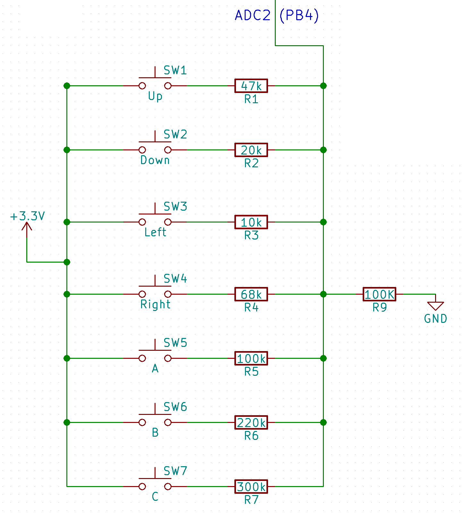

# mage-button-mapper

Quick program for mapping the ADC values for buttons in my [Mage project](https://github.com/MalphasWats/Mage).

Because I'm working with a microcontroller with only 5 usable I/O pins, I had to be creative with how to have multiple buttons.

The current version of Mage has 7 buttons: UP, DOWN, LEFT, RIGHT, A, B & C.

By wiring them as follows, I can use a single pin to capture input from each button, but also, *combinations* of buttons:



There are a few issues with doing it this way - in particular, the slight difference in resistor values (I had a bunch of +/- 5% I believe), each unit I make ends up with different ADC values! I also noticed that in some cases, A+B together ends up giving the same value as RIGHT.

Taking some more time to map out different resistor values and using ones with better tolerances would help, however, by the time it goes from a breadboard to a PCB, the whole thing ends up changing. Ultimately, I am planning to use a microcontroller with more pins which would allow 1 pin per button, but I'm happy with this solution for now.

Typical ADC values look like this:

```
#define _UP     695     47k ohm
#define _DOWN   852     20k ohm
#define _LEFT   930     10k ohm
#define _RIGHT  608     68k ohm
#define _A      512     100k ohm
#define _B      320     220k ohm
#define _C      252     300k ohm
```

//TODO: Include button combination values once established!

An earlier version also had an 8th button (actually a switch) that I put a 270 ohm resistor on, this gave an ADC value of ~ 1012 (1024 being the max with an ATTiny85 10-bit ADC). This ended up being mostly useless if you wanted to allow for multiple buttons to be held down together.

I haven't had much need for multiple buttons, although I briefly used it as a software reset for buttons *A & C*. ADC value for those two together was

```
#define _AC     584
```

These resistor values give a reasonable separation. Another earlier version of the hardware had a 51k ohm resistor on *RIGHT* which made it quite difficult to distinguish between *UP* and *RIGHT* under some conditions. Much lower than 10k ohm makes the value too large for button combinations to be distinguishable.

I've also noticed that the ADC values drift a bit if my fingers are touching the solder joints on the back of the unit, enough to cause the buttons to not be detected. I'm not sure the exact cause of this - in the most recent board iteration, I've sprayed the front and back with conformal coating to try to eliminate conductive effects, but it's possible the values could still be influenced by induction. I think only a case covering the board would help this but I will continue to experiment. Using a chip with more pins would eliminate this issue entirely.

I could of course extend this program to store the ADC values in EEPROM for each unit/chip combination, however, that seems like a lot of work for this stage of the project! Definitely something I can come back to if I end up making more than a handful of Mages.